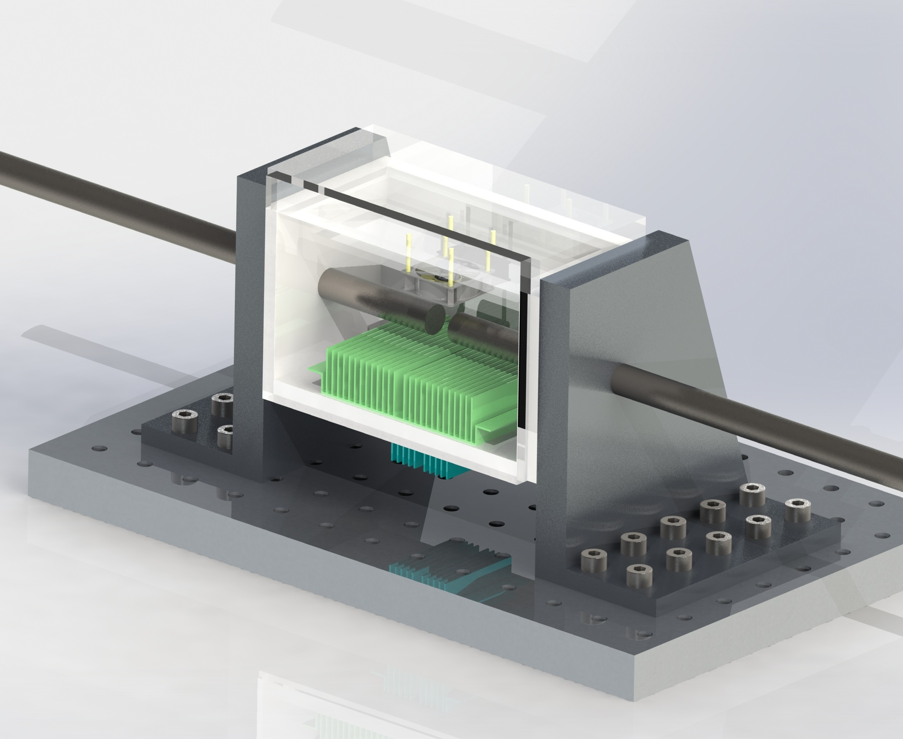
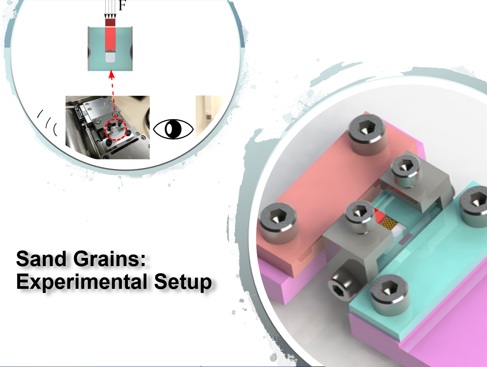
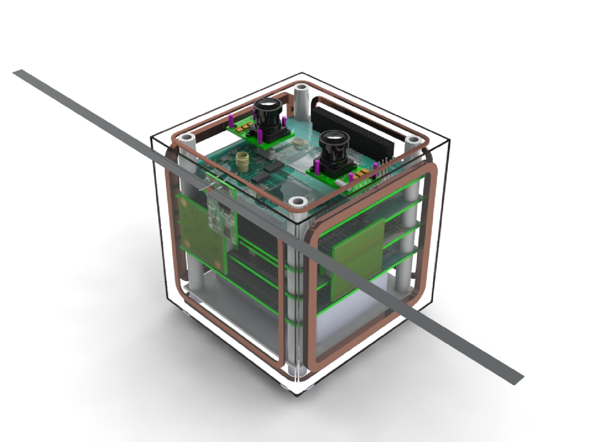

I got a degree in **Mechanical Engineering**  at Universidad Nacional de Ingeniería in Lima-Peru, where I started to work on a wide variety of design projects until nowadays.

Below you can see some of my design projects, mainly developed using **SolidWorks**.

## Thermal chamber for in-situ testing

## Equipment for mechanical testing and experimental setups 

Micro mechanical testing for:
- Micro compact tension tests
- In-situ Compression of sand grains

- Low-cost electrodynamic shaker

## Nanosatellite Chasqui I

The first Peruvian nanosatellite, built under the CubeSat standard. It was launched in 2014 during a ISS space walk [video](https://www.space.com/26841-spacewalking-cosmonaut-launches-peru-satellite-video.html?jwsource=cl){:target="_blank"}.

## Industrial Engineering Projects

From my last years of undergraduate studies, I got involved with various industrial design projects.
