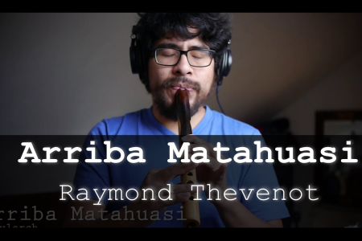

Huaylarsh is a rhythm from the central Peruvian Andes (Valle del Mantaro), very popular during carnivals and patronal feasts, and traditionally played by brass bands. Inspired by its peculiar style, Raymond Thevenot composed this tune for quena.  
I wrote the music sheet of this song many years ago, when I was part of the Music Division of my university's Centre for Folklore <a href="https://www.facebook.com/folkunioficial/" target="_blank" rel="noopener norefferer">(Folkuni)</a> in Lima, Peru. Feel free to download and play the [(music sheet/partitura)](../files/Arriba Matahuasi - GQ.pdf).

<a href="https://www.youtube.com/watch?v=6kM-fDa8S_Y" target="_blank" rel="noopener norefferer">
<figure align="center">
  
  
My version of Arriba Matahuasi. 

</figure>
</a>
 
